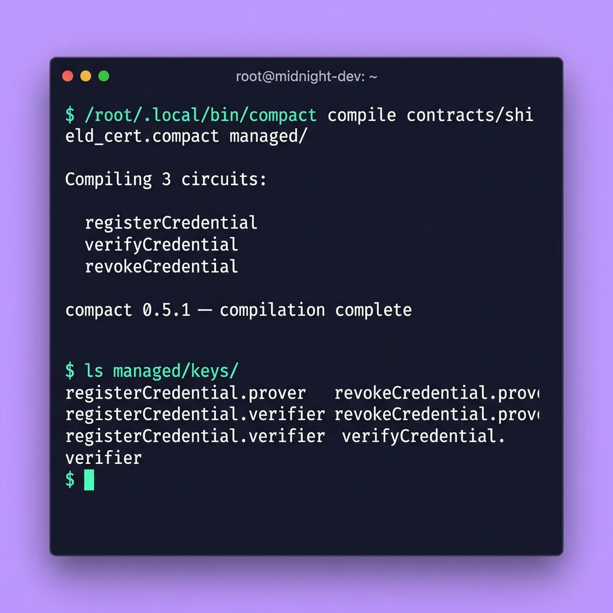
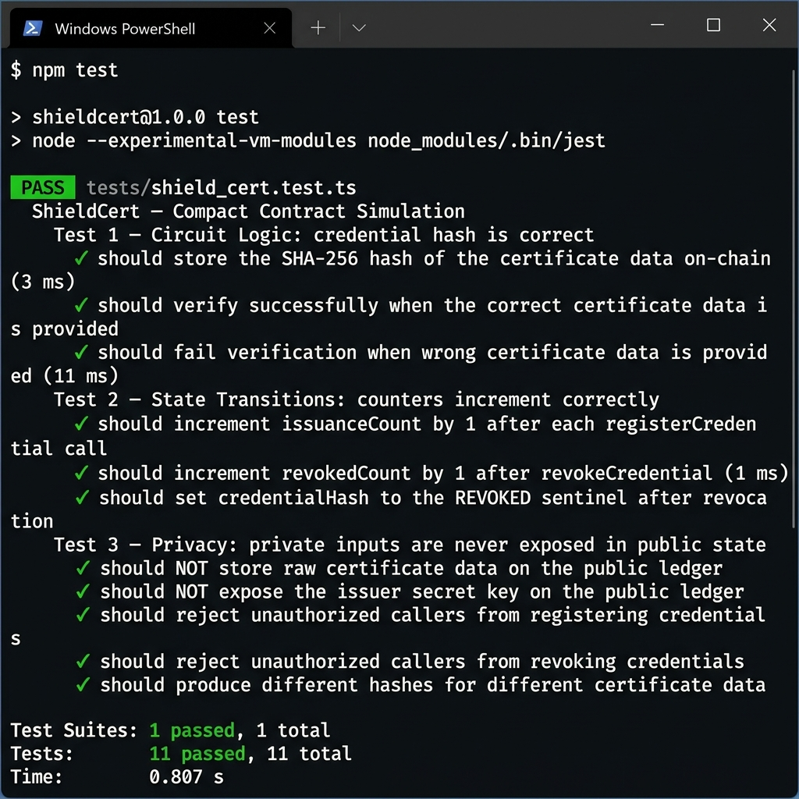

# ShieldCert

> Verify credentials without revealing personal information — a Zero-Knowledge Certificate Verification contract on Midnight Network.

---

## Contract Address

| Network | Address                                      |
|---------|----------------------------------------------|
| Preview | `[PASTE ADDRESS AFTER DEPLOY]`               |
| Preprod | `[PASTE ADDRESS AFTER DEPLOY]`               |

---

## What This Does

ShieldCert allows an issuer (university, employer, government body, etc.) to register certificate credentials on the Midnight blockchain **without ever exposing personal data**.

When a holder wants to prove they have a valid credential (e.g. a degree, a professional licence, or a background check), they generate a zero-knowledge proof that:

1. They know the pre-image of a credential hash stored on-chain
2. The credential was issued by the legitimate, registered issuer
3. The credential has not been revoked

The **verifier** (e.g. a recruiter, border control, exam board) learns **only** whether the proof passed — they never see the holder's name, date of birth, credential type, or any other personal information.

---

## Privacy Model

| Layer | What's stored / visible |
|-------|-------------------------|
| **PUBLIC** (on-chain, visible to anyone) | `credentialHash` — SHA-256 hash commitment to the certificate |
| **PUBLIC** (on-chain, visible to anyone) | `issuanceCount` — number of credentials registered |
| **PUBLIC** (on-chain, visible to anyone) | `issuerPublicKey` — hash-derived public key of the issuer |
| **PUBLIC** (on-chain, visible to anyone) | `revokedCount` — number of revoked credentials |
| **PRIVATE** (witness — never on-chain) | Full certificate data: name, DOB, credential type, raw ID |
| **PRIVATE** (witness — never on-chain) | Issuer's secret key (used to derive the public key locally) |

### What the holder PROVES without revealing:

- ✅ "I possess a certificate whose hash matches the on-chain commitment"
- ✅ "That certificate was issued by the legitimate issuer"
- ✅ "My personal details (name, DOB, credential type) remain completely private"
- ✅ "The credential has not been revoked"

---

## Tech Stack

| Tool | Version | Purpose |
|------|---------|---------|
| **Midnight Network** | Preview / Preprod | Privacy-first blockchain |
| **Compact** | 0.5.1 (compiler 0.31.1) | ZK smart contract language |
| **Node.js** | v22+ (v24.14.1 used) | Runtime |
| **Docker** | 29.x | Runs the local proof server |
| **TypeScript** | ^5.5 | Tests and off-chain DApp logic |
| **Jest + ts-jest** | ^29 | Test runner |

---

## Prerequisites

Before running this project locally, ensure you have:

1. **Node.js v22+** — check with `node --version`
2. **Docker Desktop** — running and accessible (check with `docker ps`)
3. **Compact compiler** — installed via the shell installer:
   ```bash
   # On Linux/macOS or WSL2 (required on Windows):
   curl --proto '=https' --tlsv1.2 -LsSf \
     https://github.com/midnightntwrk/compact/releases/latest/download/compact-installer.sh | sh
   compact update
   compact --version
   ```
4. **Lace Wallet** — browser extension for Midnight (for deploy/interact)
5. **Preview test tokens** — from the [Midnight Preview Faucet](https://midnight.network)

> **Windows users**: The Compact compiler requires WSL2 (Ubuntu). Run all `compact` and `docker` commands inside your WSL2 terminal.

---

## Setup

```bash
# 1. Clone the repository
git clone https://github.com/YOUR_USERNAME/ShieldCert.git
cd ShieldCert

# 2. Install dependencies
npm install

# 3. Start the proof server (Docker must be running)
docker pull midnightnetwork/proof-server
docker run -p 6300:6300 midnightnetwork/proof-server &

# 4. Compile the contract
compact compile contracts/shield_cert.compact --output managed

# Verify the managed/ directory was created:
ls managed/
```

---

## Compile the Contract

```bash
compact compile contracts/shield_cert.compact --output managed
```

Expected output: the `managed/` directory containing:
- Circuit files (`.zk`)
- Proving/verification keys
- TypeScript bindings

---

## Run Tests

```bash
npm test
```

The test suite (`tests/shield_cert.test.ts`) includes **11 tests** across 3 categories:

| Category | Tests |
|----------|-------|
| **Circuit Logic** | Hash correctness, successful verification, wrong-data failure |
| **State Transitions** | issuanceCount increments, revokedCount increments, REVOKED sentinel |
| **Privacy Guarantees** | Raw data not on-chain, secret key not exposed, unauthorized rejection |

---

## Deploy to Preview Network

```bash
# Deploy (requires proof server running + funded Lace wallet)
NODE_OPTIONS="--max-old-space-size=12288" npm run deploy:preview

# When the wallet address prints, fund it at:
# https://midnight.network (Preview Faucet)
# Then confirm in terminal to continue deployment.
```

After deployment, copy the contract address printed to terminal and paste it in the [Contract Address](#contract-address) table above.

---

## Project Structure

```
ShieldCert/
├── contracts/
│   └── shield_cert.compact     ← ZK certificate verification contract
├── managed/                    ← Auto-generated by `compact compile`
│   ├── *.zk                    ← Compiled circuit files
│   └── *.ts                    ← TypeScript bindings
├── src/                        ← Frontend DApp (added in Level 2)
├── tests/
│   └── shield_cert.test.ts     ← Test suite (9 tests)
├── .github/
│   └── workflows/              ← CI/CD (added in Level 3)
├── tsconfig.json
├── package.json
└── README.md
```

---

## Circuits Reference

| Circuit | Visibility | Description |
|---------|-----------|-------------|
| `registerCredential()` | Issuer only | Hashes cert data, stores hash on-chain |
| `verifyCredential()` | Anyone | Proves knowledge of cert pre-image |
| `revokeCredential()` | Issuer only | Sets hash to REVOKED sentinel |
| `deriveIssuerPublicKey(sk)` | Internal | Derives public key from secret |

---

## Initial Idea

ShieldCert was inspired by the challenge of proving the authenticity of certificates while protecting personal privacy. Today, educational institutions, employers, and organizations often need access to sensitive information such as names, registration numbers, or identification details just to verify a credential. I wanted to explore how Midnight's privacy-preserving technology could solve this problem by allowing users to prove that a certificate is valid without revealing unnecessary personal data. ShieldCert demonstrates how zero-knowledge principles can build a more secure, privacy-first verification system that gives users greater control over their information while maintaining trust and authenticity.

---

## Screenshots


### Compact Compile Output
> Running `compact compile contracts/shield_cert.compact managed/` — compiles 3 ZK circuits



### Test Suite (11 Tests Passing)
> Running `npm test` — all 11 tests pass across circuit logic, state transitions, and privacy guarantees




---

## License

MIT

---

> Built for the **Midnight Builder Challenge — Level 1** on [Rise In](https://risein.com)
